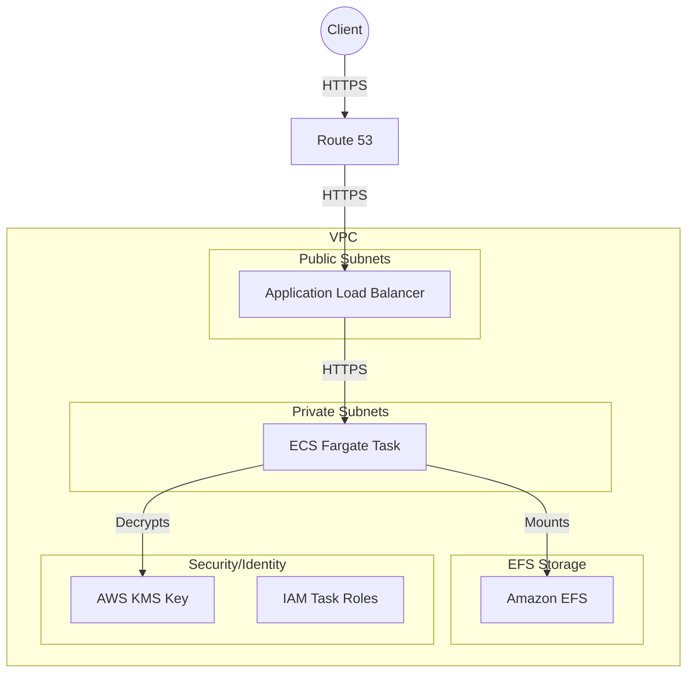

```markdown
# HashiCorp Vault on AWS ECS Fargate Deployment Guide

This document contains the complete end-to-end instructions, prerequisites, and validation commands to deploy, initialize, and test a highly available HashiCorp Vault cluster on AWS ECS using AWS KMS auto-unseal and EFS for persistent Raft storage.

---

## Prerequisites

Before starting the deployment, ensure you have the following tools and resources provisioned and configured in your environment:

* **AWS Account:** An active AWS account with appropriate permissions to create IAM roles, KMS keys, EFS, and ECS resources.
* **AWS CLI:** Installed and authenticated locally using your credentials (run `aws configure` or set your environment variables).
* **Terraform:** Installed (version 1.5+ recommended) to manage infrastructure as code.
* **Vault CLI:** Installed locally on your workstation to interact with the Vault server after deployment.
* **Docker:** Installed locally on your machine (useful for inspecting or pulling container base images).
* **Route 53 Hosted Zone:** A hosted zone for `your-dns-zone-example.com` already created in your AWS account containing the default `NS` and `SOA` records.
* **Important: (change all sreconcept.com references - my personal domain "sreconcepts.com") to your domain:
1. /layers/04-app/acm.tf
    1. In #1. Request the Certificate section, resource "aws_acm_certificate" "vault" block:
        1. Update domain_name to your donaim name.
        2. Update subject_alternative_names to your subject_alternative_name.
    2. In #2. Get your existing Route53 Zone section, data "aws_route53_zone" "main" block:
        1. Update data "aws_route53_zone" "main" name to your name.
2. /layers/04-app/acm.tf
    1. In #5. ECS Task Definition, 
        1. environment block:
            1. update api_addr to your api_addr.
    2. In #6. ECS Service & DNS, 
        1. resource "aws_route53_record" "vault" block:
            1. update “name” to your name.
---

## Repository Setup & GitHub Actions

To pull the public project and initialize your deployment pipeline, execute the following commands from your terminal:

1. Clone the public repository to your local machine:
   ```bash
   git clone [https://github.com/qaconcept/vault-aws-fargate-ha.git](https://github.com/qaconcept/vault-aws-fargate-ha.git)
   cd vault-aws-fargate-ha
   ```

2. Initialize the local Git repository and link to the upstream remote:
   ```bash
   git init
   git remote add origin [https://github.com/qaconcept/vault-aws-fargate-ha.git](https://github.com/qaconcept/vault-aws-fargate-ha.git)
   ```

3. Initialize your GitHub Actions workflow locally to test pipeline changes:
   ```bash
   # Ensure local branch is up to date with the remote
   git pull origin main --allow-unrelated-histories
   ```

---

## 1. 🏗️ Architecture Overview & Rationale

This design provides a containerized Vault deployment on AWS ECS Fargate, utilizing an Amazon EFS persistent storage volume and an AWS KMS key for auto-unseal. Based on the deployment configuration (`04-app/main.tf`), the service is deployed with a `desired_count` of exactly 1 Fargate task.

The architecture uses the following components:
* **Networking:** The ECS Fargate tasks and Application Load Balancer (ALB) reside in the subnets defined by the network layer.
* **Compute:** A single ECS cluster (`vault-cluster`) runs a task using the `hashicorp/vault:1.15.6` image and runs as user `0`.
* **Storage:** Persistent state is managed through an EFS volume mounted to `/vault/data` with encryption in transit enabled (`ENABLED`).
* **Security & Secrets:** The task uses an execution and task role created in the security layer and leverages AWS KMS for auto-unseal.
* **Ingress:** Traffic reaches the ALB over HTTPS on port 443 and is forwarded to port 8200 on the target container. A Route 53 A-record points to the ALB DNS.

---

## 2. 📊 Mermaid.js Code (Architecture Diagram)

Paste this into your README.md to render the diagram:



---

## 3. 🔐 Security & Compliance Best Practices

### 1. End-to-End Encryption
* TLS termination at the ALB.
* Encryption at rest using EFS and KMS.

### 2. Least-Privilege IAM Roles
* The ECS task role is scoped only to required KMS key actions and EFS mount permissions.

### 3. Network Isolation
* Fargate tasks run within the VPC network with security groups restricting access to port 8200 through the ALB.

### 4. Centralized Key Management
* KMS provides rotatable, auditable encryption keys.

### 5. Code Review
* Note: Code reviewed with Google Gemeni LLM

---

## Step-by-Step Implementation

### Layer 01: Networking
1. Create your VPC, public subnets, and private subnets.
2. Initialize, plan, and apply the network state.
   ```bash
   cd layers/01-network/
   terraform init
   terraform plan
   terraform apply -auto-approve
   ```

### Layer 02: Security
1. Create the AWS KMS key for auto-unseal, IAM roles for ECS tasks, and EFS security groups.
2. Ensure the key alias matches `alias/prod-v5-vault-key`.
3. Initialize, plan, and apply the security state.
   ```bash
   cd ../02-security
   terraform init
   terraform plan
   terraform apply -auto-approve
   ```

### Layer 03: Storage
1. Provision the Amazon EFS file system, access point, and security groups.
2. Initialize, plan, and apply the storage state.
   ```bash
   cd ../03-storage
   terraform init
   terraform plan
   terraform apply -auto-approve
   ```

### Layer 04: Application (ECS, ALB, and ACM)
1. Verify that `04-app/main.tf` is properly configured, and any redundant local files have been deleted. Also update 'sreconcepts.com' to your Route 53 Hosted zone (ie: 'example.com')
2. Initialize, plan, and apply the final infrastructure layer:
   ```bash
   cd ../04-app
   terraform init
   terraform plan
   terraform apply -auto-approve
   ```
3. Verify the infrastructure (Wait about 3-5 minutes after 04-app: Apply complete!):
   ```bash
   # Verify Task Status
   TASK_ARN=$(aws ecs list-tasks --cluster vault-cluster --service-name vault-service --query 'taskArns[0]' --output text)
   aws ecs describe-tasks --cluster vault-cluster --tasks $TASK_ARN --query 'tasks[0].lastStatus' --output text

   Output should = 'RUNNING'

   # Verify Target Health
   TG_ARN=$(aws elbv2 describe-target-groups --names vault-tg --query 'TargetGroups[0].TargetGroupArn' --output text)
   aws elbv2 describe-target-health --target-group-arn $TG_ARN --query 'TargetHealthDescriptions[*].TargetHealth.State' --output text

   Output should = [ "healthy" ]

---

## Vault Initial Setup

1. Open your web browser and navigate to: `https://vault.sreconcepts.com/` (note: replace vault.sreconcepts.com with your own Route 53 hosted zone A record)
2. Vault will be Sealed... select 'Create a new Raft cluster' and click Next
3. You will see the Vault Initial Setup screen.
4. Configure the **Key shares** and **Key threshold**:
   * **Key shares:** `3`
   * **Key threshold:** `2`
5. Click **Initialize**. (wait for Vault to be initialized)
6. **CRITICAL STEP:** Download and securely store the generated Unseal Keys and Initial Root Token.

---

## Testing the Vault Cluster

Configure your environment and verify operations using the Vault CLI:

### 1. Set the Address and Log In (note: replace vault.sreconcepts.com with your own Route 53 hosted zone A record)
```bash
export VAULT_ADDR="https://vault.sreconcepts.com"
vault login
```
Provide the root token when prompted.

#### Expected Output:
```text
Success! You are now authenticated. The token information displayed below
is already stored in the token helper. You do NOT need to run "vault login"
again. Future Vault requests will automatically use this token.

Key                  Value
---                  -----
token                hvs.xxxxxxxxxxxxxxxxxxxxxxxx
token_accessor       46WIYkcaITgfNG55isXPKcZC
token_duration       ∞
token_renewable      false
token_policies       ["root"]
identity_policies    []
policies             ["root"]
```

### 2. Enable the KV v2 Secrets Engine
```bash
vault secrets enable -path=secret kv-v2
```

#### Expected Output:
```text
Success! Enabled the kv-v2 secrets engine at: secret/
```

### 3. Write Your Test Secret
```bash
vault kv put secret/hello foo=world
```

#### Expected Output:
```text
== Secret Path ==
secret/data/hello

======= Metadata =======
Key                Value
---                -----
created_time       2026-05-01T08:22:39.231758143Z
custom_metadata    <nil>
deletion_time      n/a
destroyed          false
version            1
```

### 4. Verify the Secret
```bash
vault kv get secret/hello
```

#### Expected Output:
```text
== Secret Path ==
secret/data/hello

======= Metadata =======
Key                Value
---                -----
created_time       2026-05-01T08:22:39.231758143Z
custom_metadata    <nil>
deletion_time      n/a
destroyed          false
version            1

=== Data ===
Key    Value
---    -----
foo    world
```
```